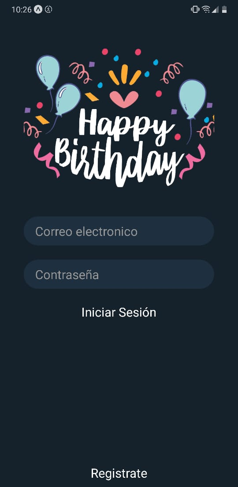
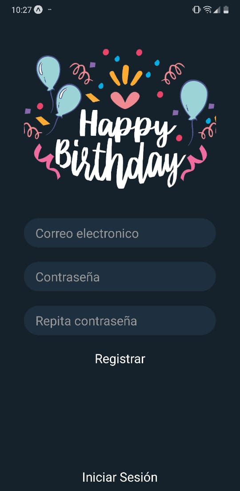
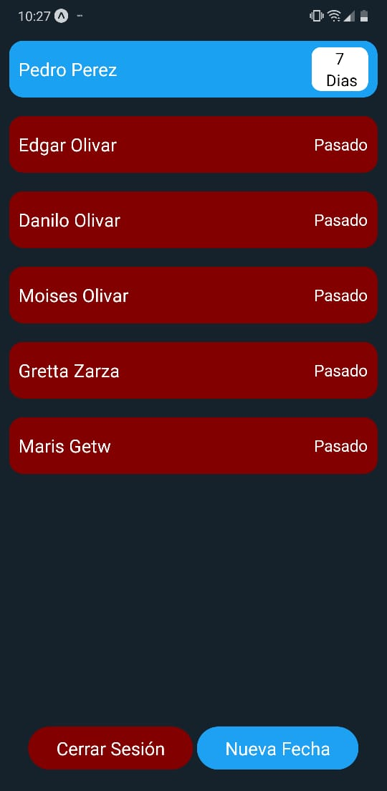
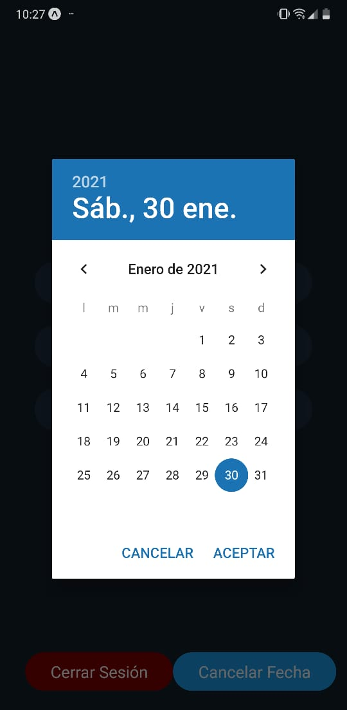

# App de cumpleaños!

## Este es un proyecto de ejemplo utilizando principios básicos de desarrollo móvil con expo y elementos de react-native
## 

Snaps: 
1. LoginScreen: 

  

2. RegisterScreen: 

  

3. DatesScreen: 

  

4. DatePickerScreen: 

  


## Run ``` expo start ```

E.O